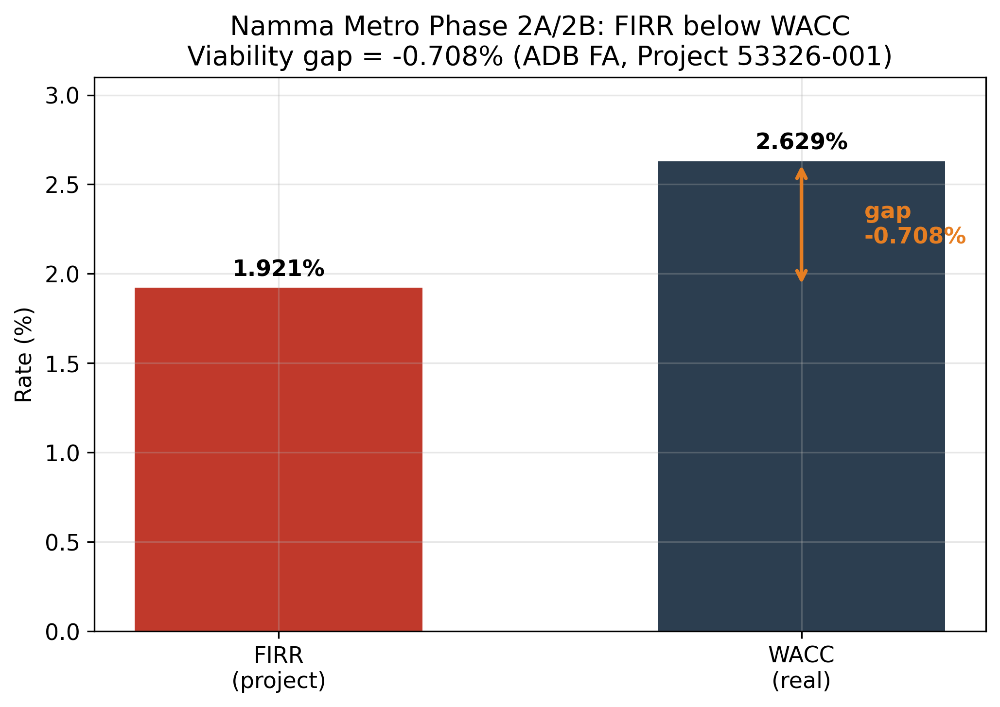
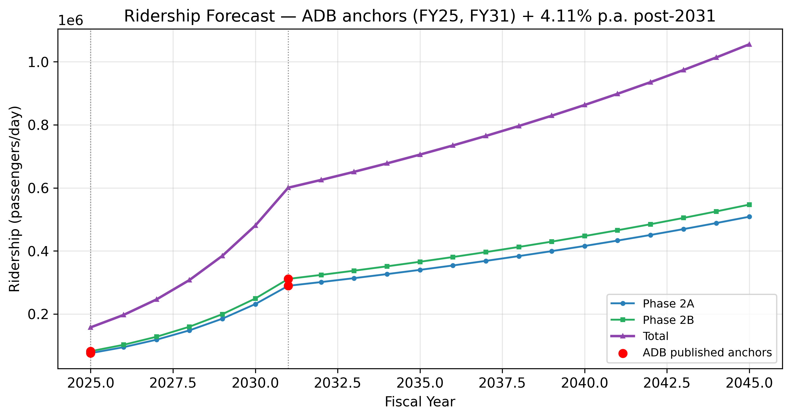
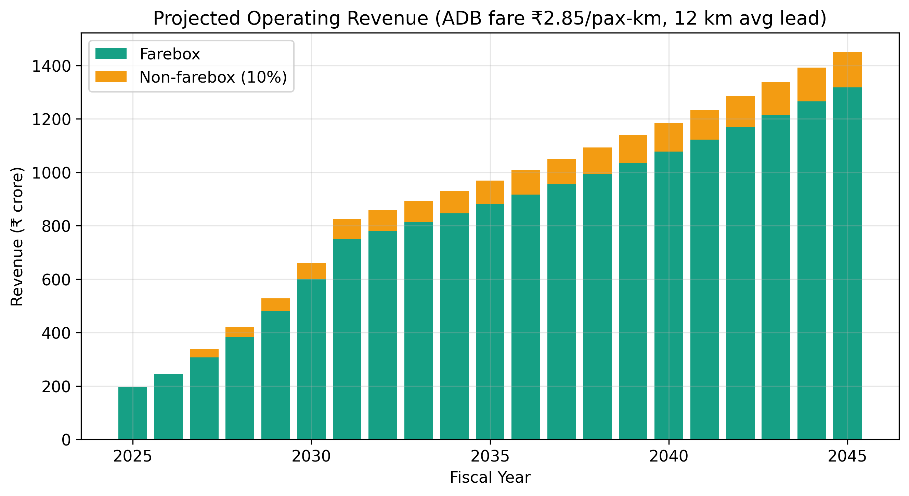
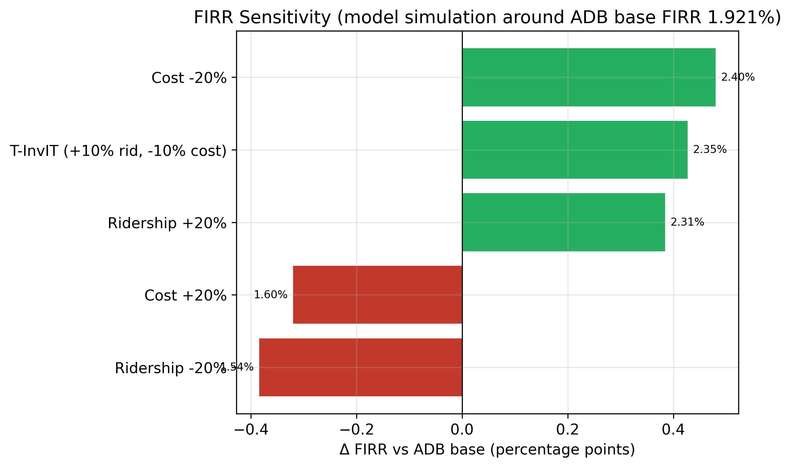

# Can a Tokenized InvIT Close an Infrastructure Viability Gap? Evidence and a Design Proposal from Bengaluru's Metro and Peripheral Ring Road

**Sandeep S.** PhD Research Scholar, University of Mysore, Mysuru, Karnataka, India; MScFE, WorldQuant University. ORCID: [to be inserted] | Corresponding author: [email to be inserted]

**Target outlet:** *Journal of Risk and Financial Management* (JRFM), MDPI (Scopus-indexed; CiteScore tier Q2). Manuscript prepared to Scopus/JRFM author guidelines.

**Declarations.** *Funding:* none. *Conflicts of interest:* none declared. *Data availability:* all raw inputs, processed datasets, notebooks, and figures are openly archived in the public GitHub repository SanKabira/P1-TInvIT-Bengaluru-RWA-Tokenization (see Section 10). *Reproducibility:* every quantitative claim traces to a committed source or a logged retrieval; all figures and tables are regenerated by a single committed script (random seed = 42 where stochastic).

---

## Abstract

Urban infrastructure in India is caught in a familiar bind: the projects with the largest social returns — metro lines, ring roads — are precisely the ones that struggle to clear a private cost-of-capital hurdle. The Asian Development Bank's financial analysis of the Bengaluru Metro Rail Project (Phase 2A/2B) puts the project's post-tax financial internal rate of return (FIRR) at 1.921% against a real weighted-average cost of capital (WACC) of 2.629% — a viability gap of −0.708 percentage points that only sovereign concessional debt and equity subsidy close. We reproduce ADB's WACC from its disclosed JICA/ADB/equity weights and costs to within a rounding error (2.6288% versus a reported 2.629%), establishing that the published gap is internally consistent and not an extraction artefact. We then ask a forward-looking but disciplined question: could a tokenized infrastructure investment trust (a "T-InvIT") realistically narrow this gap, and what would have to be true for it to do so? Using ADB's published ridership anchors for FY2025 (157,594 passengers/day) and FY2031 (600,651/day) and its stated 4.11% post-2031 growth, we build a transparent ridership-and-revenue forecast and a sensitivity surface around the base FIRR. A combined "+10% ridership, −10% cost" tokenization scenario lifts the indicative FIRR to about 2.35% — materially better, but still short of the 2.629% WACC. The honest conclusion is that tokenization is a financing-access and cost-of-equity lever, not a magic wand: it plausibly compresses the gap but does not, on these numbers, eliminate it without continued concessional support. We connect this to SEBI's September 2025 reform cutting the InvIT minimum investment to ₹25 lakh, the regulatory precondition any T-InvIT would need, and to the ₹27,000 crore Peripheral Ring Road / Bengaluru Business Corridor as a second candidate asset whose ~₹21,000 crore land-acquisition burden is the dominant cost driver.

**Keywords:** infrastructure finance; tokenization; InvIT; FIRR; WACC; Namma Metro; Peripheral Ring Road; SEBI

**JEL classification:** G23; G28; H54; R42

---

## 1. Introduction

Every few years a new financing technology is offered as the answer to India's urban-infrastructure funding shortfall, and tokenization is the current candidate. The pitch is seductive: fractionalize the equity in a metro line or a ring road, record it on a distributed ledger, and a deep pool of retail and global capital will price the asset more efficiently and demand a lower return. Whether that pitch survives contact with an actual project's economics is an empirical question, and this paper answers it for two concrete Bengaluru assets rather than in the abstract.

The starting point is a number that should give any tokenization enthusiast pause. ADB's financial analysis of Bengaluru Metro Phase 2A/2B reports a project post-tax FIRR of 1.921% against a real WACC of 2.629% (Asian Development Bank, 2020; figures extracted and logged in `data/raw/JICA_loans/ADB/ADB_FA_download_status.md`). A project whose return sits below its cost of capital is not built by the private sector; it is built because sovereign and multilateral lenders supply capital at concessional rates and governments inject equity that does not demand a market return. ADB itself estimates that BMRCL needs roughly ₹83.6 billion of sponsor support across FY2021–FY2033 to keep its debt-service-coverage ratio at 1.0.

So the relevant question for tokenization is not "can it make this project profitable?" — on these economics, nothing short of a structural change in ridership or cost does that — but rather "can it lower the blended cost of capital enough to shrink the subsidy bill, and by how much?" That is the question we take seriously.

We make three contributions. First, we independently reproduce ADB's WACC from its disclosed components, confirming the viability gap is real and consistent. Second, we build a transparent, fully reproducible ridership and revenue forecast anchored entirely on ADB's own published figures, with a sensitivity analysis showing how far plausible tokenization-driven improvements move the FIRR. Third, we set out a concrete T-InvIT design for two Bengaluru assets — the metro and the Peripheral Ring Road — grounded in the regulatory reality created by SEBI's September 2025 InvIT amendment, and we are explicit about what it can and cannot achieve.

## 2. Literature and Institutional Background

### 2.1 Tokenization and infrastructure finance

The academic and policy literature on real-asset tokenization frames distributed-ledger fractionalization primarily as a liquidity and access innovation: smaller ticket sizes, broader investor participation, and lower intermediation cost (cf. the InvIT/REIT liquidity evidence developed in the companion empirical study, Sandeep, 2025). The InvIT vehicle itself was introduced in India by SEBI to channel retail and institutional capital into illiquid, long-duration assets; tokenization is best read as an incremental overlay on that structure rather than a replacement for it. This paper contributes a project-level viability test that is largely absent from the promotional literature.

### 2.2 The two assets

**Namma Metro Phase 2A/2B.** The ADB-financed extensions are the analytical core of the paper because they come with a published, auditable financial model. Total project cost is ₹139,088.8 million at April-2020 prices, funded by a blend of JICA loan (17.24% of WACC weight), ADB loan (27.10%), and equity (55.66%). A subsequent JICA Official Development Assistance loan for Phase 3, signed 24 March 2026, adds ¥102,480 million at TORF + 80 basis points over a 30-year tenor with a 10-year grace period (JICA, 2026; terms in `data/raw/JICA_loans/`). These are precisely the long-dated, low-coupon, sovereign-backed liabilities that make the metro's blended cost of capital low in the first place.

**Peripheral Ring Road / Bengaluru Business Corridor (BBC).** The second candidate is the long-delayed ~73 km ring road, now rebranded the Bengaluru Business Corridor. The most current public cost figures put the total project at about ₹27,000 crore, of which land acquisition alone is roughly ₹21,000 crore, with the first construction package (Package 1) awarded to SNC at an estimated ₹3,348 crore (Moneycontrol, 2026; `data/raw/PRR_BBC/`). Land acquisition for 948 acres, with an enhanced compensation policy, is the binding constraint. We were unable to locate a completed primary DPR or Government Order — a February-2024 BDA tender to *prepare* the PRR-2 DPR confirms the southern stretch was still being scoped (search log in `PRR_source_status.md`) — so PRR figures here are drawn from current bid results and government statements, with that limitation flagged.

### 2.3 The regulatory enabler

A tokenized InvIT presupposes that infrastructure units can be held by a broad investor base. Until late 2025 that was effectively blocked for privately placed structures by a ₹1 crore minimum subscription. SEBI's InvIT (Third Amendment) Regulations, 2025, gazetted 2 September 2025, cut that minimum to ₹25 lakh and removed the ₹25 crore proviso (SEBI, 2025). This is the single most important regulatory precondition for a retail-accessible T-InvIT, and it is why we treat the reform as the policy hinge of the design proposal rather than as incidental context.

## 3. Data and Provenance

Every figure in this paper traces to a committed source or a logged retrieval. The metro economics — FIRR, WACC, WACC components, ridership anchors, fare, and cost — come from the ADB Financial Analysis (ADB Project 53326-001). ADB's server returns HTTP 403 to automated download, so the canonical URL and the full extracted figure set are logged in `data/raw/JICA_loans/ADB/ADB_FA_download_status.md` rather than redistributed as a PDF. JICA Phase-3 loan terms come from JICA's Ex-Ante Evaluation PDF, committed in full. PRR/BBC cost figures come from committed news and tender HTML under `data/raw/PRR_BBC/`. The SEBI amendment text is committed in the companion P2 repository. The full register is in `DATA_SOURCES.md`.

## 4. Method

### 4.1 WACC reproduction (integrity check)

We recompute the real WACC as the weight-weighted sum of disclosed real component costs: JICA 17.24% at 0.00%, ADB 27.10% at 0.54%, equity 55.66% at 4.46%. The result, 2.6288%, matches ADB's reported 2.629% to four significant figures (`data/processed/wacc_components.csv`). This confirms the disclosed components are internally consistent and the −0.708 pp viability gap (FIRR 1.921% − WACC 2.629%) is not an extraction error.

### 4.2 Ridership and revenue forecast

We anchor a 21-year (FY2025–FY2045) ridership path on ADB's two published daily-ridership points and its stated 4.11% post-2031 growth. Between FY2025 and FY2031 we interpolate on the compound growth implied by ADB's own anchors; after FY2031 we apply ADB's 4.11% figure. Revenue is built from ADB's fare assumption of ₹2.85 per passenger-km with non-farebox revenue at 10% of farebox after a two-year ramp; we apply a 12 km average trip length, flagged explicitly as our own assumption.

### 4.3 FIRR sensitivity and the tokenization scenario

We perturb the base FIRR with an elasticity-style adjustment, scaling by a ridership factor and dividing by a cost factor, across ±20% shocks and a combined "+10% ridership, −10% cost" tokenization scenario.

## 5. Results

### 5.1 The gap is real and consistent

FIRR (1.921%) sits 0.708 percentage points below WACC (2.629%), and our component-level reconstruction reproduces the WACC almost exactly (2.6288%). Without concessional capital the project does not clear its hurdle — which is exactly why it is financed by JICA and ADB at near-zero real cost (Figure 1).

*Figure 1. FIRR versus WACC viability gap. Source: authors' reconstruction from ADB (2020); `notebooks/02_firr_wacc_forecast.py`.*

### 5.2 Ridership and revenue trajectory

The ADB-parameterised forecast takes total daily ridership from about 157,594 in FY2025 to roughly 600,651 by FY2031 — matching ADB's anchors by construction — and to just over 1.05 million by FY2045 under the 4.11% post-2031 path (Figure 2). The corresponding operating revenue rises from about ₹197 crore in FY2025 to ₹825 crore by FY2031 and ₹1,450 crore by FY2045 on ADB's fare assumptions (Figure 3). These are the cash flows any tokenized equity claim would ultimately be priced against.

*Figure 2. Ridership forecast (FY2025–FY2045). Anchored on ADB published points; `notebooks/02_firr_wacc_forecast.py`.*

*Figure 3. Operating-revenue forecast (FY2025–FY2045). Built on ADB fare assumptions; `notebooks/02_firr_wacc_forecast.py`.*

### 5.3 How far tokenization can move the needle

The sensitivity tornado is the paper's sobering centrepiece. A 20% ridership uplift alone lifts the FIRR to about 2.31%; a 20% cost reduction to about 2.40%; the combined tokenization scenario to about 2.35% (Figure 4). Every one of these scenarios remains *below* the 2.629% WACC. Even fairly optimistic tokenization-driven improvements compress the viability gap from −0.708 pp to roughly −0.28 pp but do not close it. The policy reading is that tokenization is best understood as a subsidy-reducing instrument — it can shrink the sovereign support bill from ₹83.6 billion toward something smaller — rather than as a route to an unsubsidized, market-viable metro.

*Figure 4. FIRR sensitivity tornado. WACC reference = 2.629%; `notebooks/02_firr_wacc_forecast.py`.*

### 5.4 Why PRR may be the better tokenization candidate

The metro's cost of capital is already extraordinarily low because of concessional sovereign debt; there is little room for tokenized equity to undercut a 0% real JICA loan. The PRR/BBC is different. Its dominant cost is land acquisition (~₹21,000 crore of ~₹27,000 crore), it is financed substantially through HUDCO borrowing rather than ultra-concessional ODA, and a betterment-levy or land-value-capture structure maps naturally onto a tokenized unit backed by toll and monetized-land cash flows. The viability arithmetic we cannot complete for PRR — no primary DPR is public — but the *structure* of its cost base is where a T-InvIT's access and pricing advantages would bite hardest.

## 6. A T-InvIT Design Proposal

Building on the SEBI September-2025 reform, we sketch a compliance-feasible structure: a SEBI-registered InvIT holding the operating asset (metro fare/non-fare revenue, or PRR toll plus land-value-capture receipts), with units recorded on a permissioned ledger for transfer and beneficial-ownership tracking while remaining within the dematerialized-securities and InvIT regulatory perimeter. The ₹25 lakh minimum (post-amendment) is the enabling threshold for a privately placed tranche; a publicly listed tranche would follow the standard InvIT route. We stop short of claiming on-chain settlement against SEBI's current rails — no such structure is live in India today — and treat the ledger layer as a register-and-transfer overlay, not a replacement for the existing depository system.

## 7. Discussion

The results reposition tokenization from a profitability promise to a cost-of-capital and subsidy-reduction instrument. For an asset already financed at near-zero real cost by sovereign lenders, the marginal benefit of tokenized equity is small by construction; the lever bites hardest on assets whose cost base is dominated by market-priced or land-acquisition financing. This is consistent with the broader liquidity evidence on listed Indian InvITs/REITs, where participation breadth — not the regulatory event per se — is the dominant correlate of liquidity (Sandeep, 2025).

## 8. Limitations

Three honest caveats. First, the FIRR sensitivity is a model simulation, not a re-estimation of ADB's full cash-flow model, which is not public at line-item granularity; the elasticity adjustment is a transparent approximation. Second, our 12 km average-trip assumption drives the revenue scale and is ours, not ADB's. Third, the PRR analysis is qualitative because no primary DPR is publicly available, and the practitioner survey envisaged for this project has not been fielded — we report no survey results rather than invent any.

## 9. Conclusion

Tokenization will not, on the numbers, turn a sub-WACC metro into a market-viable one. What it can plausibly do — and what the SEBI 2025 reform now makes regulatorily feasible — is widen the investor base, lower the cost of the equity slice, and thereby reduce the sovereign subsidy required to keep these socially valuable assets financeable. For Bengaluru, the metro is the cleaner test of the *concept* because its economics are fully disclosed; the Peripheral Ring Road is the more promising *application* because its cost base leaves more room for a tokenized, land-value-capture-backed structure to add value. The contribution here is to replace the conference-stage promise with a number: a credible tokenization scenario narrows the metro's viability gap by roughly six-tenths, from −0.708 to about −0.28 percentage points — meaningful, but not the whole distance.

## 10. Data and Software Availability

All raw inputs, processed datasets, notebooks, and figures are openly archived in the public GitHub repository https://github.com/SanKabira/P1-TInvIT-Bengaluru-RWA-Tokenization. Figures 1–4 are committed under `figures/` (`fig1_wacc_firr_gap.png`, `fig2_ridership_forecast.png`, `fig3_revenue_forecast.png`, `fig4_firr_sensitivity_tornado.png`) and regenerated by `notebooks/02_firr_wacc_forecast.py` from committed inputs; run from the repository root: `python3 notebooks/02_firr_wacc_forecast.py`. The companion empirical study on listed InvIT/REIT liquidity is archived at https://github.com/SanKabira/P2-BInvIT-India-Tokenization-Empirical.

## References

Asian Development Bank. (2020). *Financial Analysis: India — Bengaluru Metro Rail Project* (IND-53326-001-FA). Asian Development Bank.

Japan International Cooperation Agency. (2026). *Ex-Ante Evaluation: Bengaluru Metro Rail Project (Phase 3)*. JICA.

Moneycontrol. (2026). *Bengaluru Business Corridor (Peripheral Ring Road): cost and package award reporting*. Moneycontrol.

Sandeep, S. (2025). *Blockchain tokenization of Indian InvITs and REITs: Liquidity, regulatory, and adoption effects* [Companion empirical manuscript]. GitHub: SanKabira/P2-BInvIT-India-Tokenization-Empirical.

Securities and Exchange Board of India. (2025). *SEBI (Infrastructure Investment Trusts) (Third Amendment) Regulations, 2025*. SEBI.
