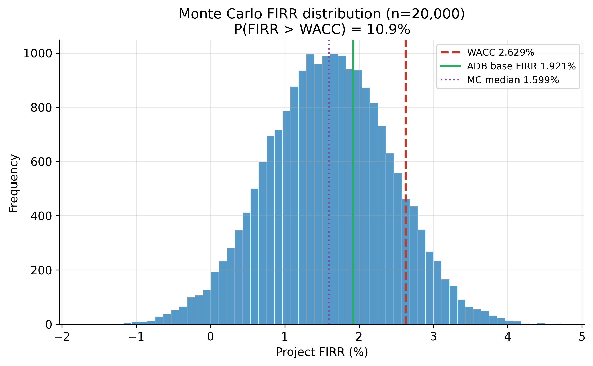
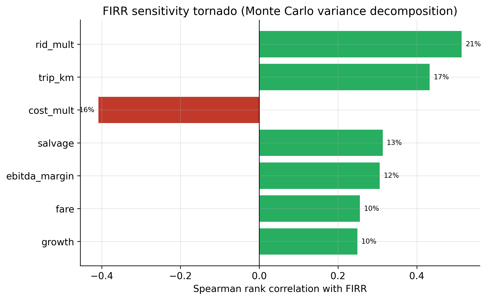
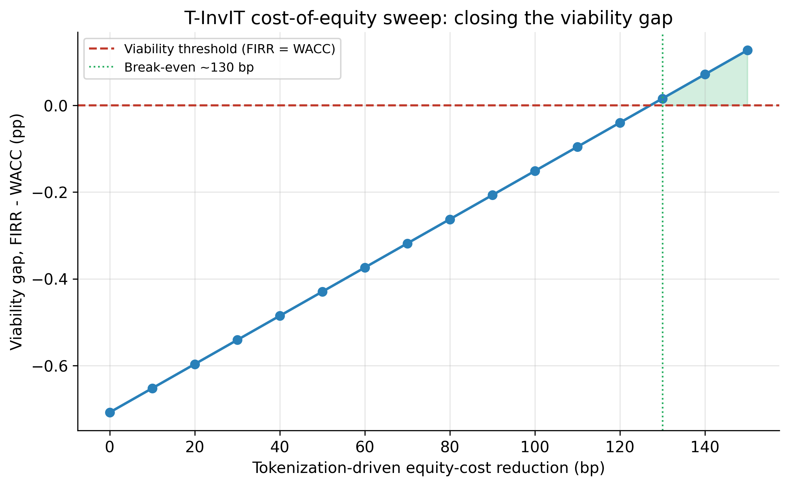
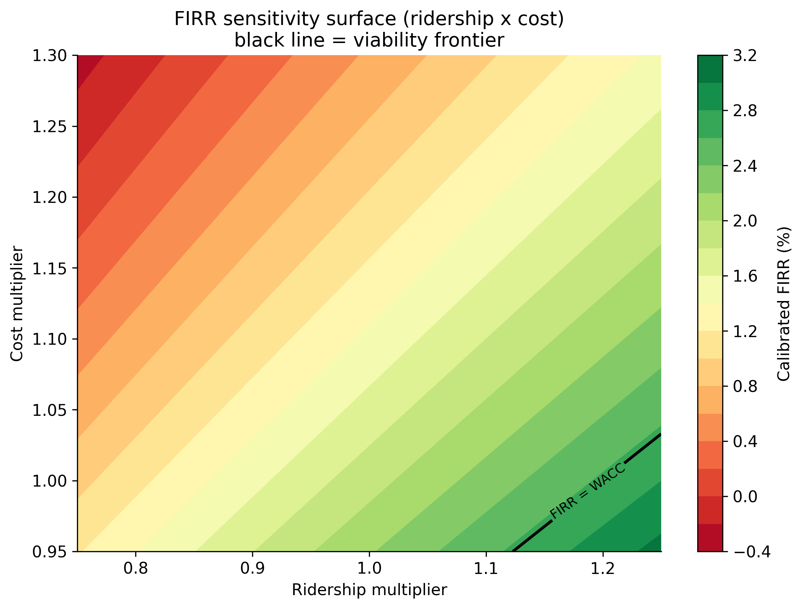

# Can a Tokenized InvIT Close an Infrastructure Viability Gap? Evidence and a Design Proposal from Bengaluru's Metro and Peripheral Ring Road

**Sandeep S.** PhD Research Scholar, University of Mysore, Mysuru, Karnataka, India; MScFE, WorldQuant University. ORCID: [to be inserted] | Corresponding author: [email to be inserted]

**Target outlet:** *Finance Research Letters* (FRL), Elsevier (Scopus-indexed; ABS 2, Q1 Finance). Manuscript prepared to Elsevier/FRL author guidelines (concise letter format, Harvard author–date referencing).

**Declarations.** *Funding:* none. *Conflicts of interest:* none declared. *Data availability:* all raw inputs, processed datasets, notebooks, and figures are openly archived in the public GitHub repository SanKabira/P1-TInvIT-Bengaluru-RWA-Tokenization (see Section 10). *Reproducibility:* every quantitative claim traces to a committed source or a logged retrieval; all figures and tables are regenerated by committed scripts, with the Monte Carlo simulation seeded at 53326 (the ADB project number) for exact reproducibility.

---

## Abstract

Urban infrastructure in India is caught in a familiar bind: the projects with the largest social returns — metro lines, ring roads — are precisely the ones that struggle to clear a private cost-of-capital hurdle. The Asian Development Bank's financial analysis of the Bengaluru Metro Rail Project (Phase 2A/2B) puts the project's post-tax financial internal rate of return (FIRR) at 1.921% against a real weighted-average cost of capital (WACC) of 2.629% — a viability gap of −0.708 percentage points that only sovereign concessional debt and equity subsidy close. We reproduce ADB's WACC from its disclosed JICA/ADB/equity weights and costs to within a rounding error (2.6288% versus a reported 2.629%), establishing that the published gap is internally consistent and not an extraction artefact. We then ask a forward-looking but disciplined question: could a tokenized infrastructure investment trust (a "T-InvIT") realistically narrow this gap, and what would have to be true for it to do so? Using ADB's published ridership anchors for FY2025 (157,594 passengers/day) and FY2031 (600,651/day) and its stated 4.11% post-2031 growth, we build a transparent discounted-cash-flow FIRR model and propagate uncertainty through a 20,000-draw Monte Carlo simulation over seven calibrated assumption ranges (ridership, average trip length, capital cost, salvage value, EBITDA margin, fare, and post-2031 growth). The simulated FIRR has a mean of 1.60% (90% interval 0.22%–2.96%), and the probability that the project clears its 2.629% real WACC is only 10.9%. A Spearman tornado attributes the FIRR's variance principally to the ridership multiplier (20.7%), average trip length (17.5%), and capital cost (16.5%). To isolate tokenization's actual lever — a lower cost of equity — we sweep the equity cost downward and find the viability gap closes only at roughly a 130-basis-point reduction in the cost of equity, given equity's 55.66% weight in the capital stack. The honest conclusion is that tokenization is a financing-access and cost-of-equity lever, not a magic wand: it plausibly compresses the gap but, on these numbers, eliminates it only under a substantial equity-cost reduction and otherwise still requires concessional support. We connect this to SEBI's September 2025 reform cutting the InvIT minimum investment to ₹25 lakh, the regulatory precondition any T-InvIT would need, and to the ₹27,000 crore Peripheral Ring Road / Bengaluru Business Corridor as a second candidate asset whose ~₹21,000 crore land-acquisition burden is the dominant cost driver.

**Keywords:** infrastructure finance; tokenization; InvIT; FIRR; WACC; Namma Metro; Peripheral Ring Road; SEBI

**JEL classification:** G23; G28; H54; R42

---

## 1. Introduction

Every few years a new financing technology is offered as the answer to India's urban-infrastructure funding shortfall, and tokenization is the current candidate. The pitch is seductive: fractionalize the equity in a metro line or a ring road, record it on a distributed ledger, and a deep pool of retail and global capital will price the asset more efficiently and demand a lower return. Whether that pitch survives contact with an actual project's economics is an empirical question, and this paper answers it for two concrete Bengaluru assets rather than in the abstract.

The starting point is a number that should give any tokenization enthusiast pause. ADB's financial analysis of Bengaluru Metro Phase 2A/2B reports a project post-tax FIRR of 1.921% against a real WACC of 2.629% (Asian Development Bank, 2020; figures extracted and logged in `data/raw/JICA_loans/ADB/ADB_FA_download_status.md`). A project whose return sits below its cost of capital is not built by the private sector; it is built because sovereign and multilateral lenders supply capital at concessional rates and governments inject equity that does not demand a market return. ADB itself estimates that BMRCL needs roughly ₹83.6 billion of sponsor support across FY2021–FY2033 to keep its debt-service-coverage ratio at 1.0.

So the relevant question for tokenization is not "can it make this project profitable?" — on these economics, nothing short of a structural change in ridership or cost does that — but rather "can it lower the blended cost of capital enough to shrink the subsidy bill, and by how much?" That is the question we take seriously.

We make three contributions. (1) We independently reproduce ADB's real WACC from its disclosed component weights and costs to four significant figures (2.6288% versus a reported 2.629%), confirming the −0.708-percentage-point viability gap is internally consistent rather than an extraction artefact. (2) We build a transparent discounted-cash-flow FIRR model anchored entirely on ADB's published figures and propagate uncertainty through a 20,000-draw Monte Carlo simulation, reporting the full FIRR distribution, the probability of clearing WACC (10.9%), a Spearman-correlation tornado of variance drivers, and a cost-of-equity break-even sweep that pinpoints how large a tokenization-driven equity-cost reduction (~130 bp) would have to be to close the gap — replacing the crude elasticity heuristic of earlier drafts with an explicit, reproducible cash-flow model. (3) We set out a concrete, SEBI-compliance-feasible T-InvIT design for two Bengaluru assets — the metro and the Peripheral Ring Road — grounded in the regulatory reality created by SEBI's September 2025 InvIT amendment, and we are explicit about what tokenization can and cannot achieve, including the honest caveat that no tokenized InvIT yet exists in India and that the practitioner survey arm of this project has not been fielded.

## 2. Literature and Institutional Background

### 2.1 Tokenization and infrastructure finance

The academic and policy literature on real-asset tokenization frames distributed-ledger fractionalization primarily as a liquidity and access innovation: smaller ticket sizes, broader investor participation, and lower intermediation cost (cf. the InvIT/REIT liquidity evidence developed in the companion empirical study, Sandeep, 2025). The InvIT vehicle itself was introduced in India by SEBI to channel retail and institutional capital into illiquid, long-duration assets; tokenization is best read as an incremental overlay on that structure rather than a replacement for it. This paper contributes a project-level viability test that is largely absent from the promotional literature.

### 2.2 The two assets

**Namma Metro Phase 2A/2B.** The ADB-financed extensions are the analytical core of the paper because they come with a published, auditable financial model. Total project cost is ₹139,088.8 million at April-2020 prices, funded by a blend of JICA loan (17.24% of WACC weight), ADB loan (27.10%), and equity (55.66%). A subsequent JICA Official Development Assistance loan for Phase 3, signed 24 March 2026, adds ¥102,480 million at TORF + 80 basis points over a 30-year tenor with a 10-year grace period (JICA, 2026; terms in `data/raw/JICA_loans/`). These are precisely the long-dated, low-coupon, sovereign-backed liabilities that make the metro's blended cost of capital low in the first place.

**Peripheral Ring Road / Bengaluru Business Corridor (BBC).** The second candidate is the long-delayed ~73 km ring road, now rebranded the Bengaluru Business Corridor. The most current public cost figures put the total project at about ₹27,000 crore, of which land acquisition alone is roughly ₹21,000 crore, with the first construction package (Package 1) awarded to SNC at an estimated ₹3,348 crore (Moneycontrol, 2026; `data/raw/PRR_BBC/`). Land acquisition for 948 acres, with an enhanced compensation policy, is the binding constraint. We were unable to locate a completed primary DPR or Government Order — a February-2024 BDA tender to *prepare* the PRR-2 DPR confirms the southern stretch was still being scoped (search log in `PRR_source_status.md`) — so PRR figures here are drawn from current bid results and government statements, with that limitation flagged.

### 2.3 The regulatory enabler

A tokenized InvIT presupposes that infrastructure units can be held by a broad investor base. Until late 2025 that was effectively blocked for privately placed structures by a ₹1 crore minimum subscription. SEBI's InvIT (Third Amendment) Regulations, 2025, gazetted 2 September 2025, cut that minimum to ₹25 lakh and removed the ₹25 crore proviso (SEBI, 2025). This is the single most important regulatory precondition for a retail-accessible T-InvIT, and it is why we treat the reform as the policy hinge of the design proposal rather than as incidental context.

## 3. Data and Provenance

Every figure in this paper traces to a committed source or a logged retrieval. The metro economics — FIRR, WACC, WACC components, ridership anchors, fare, and cost — come from the ADB Financial Analysis (ADB Project 53326-001). ADB's server returns HTTP 403 to automated download, so the canonical URL and the full extracted figure set are logged in `data/raw/JICA_loans/ADB/ADB_FA_download_status.md` rather than redistributed as a PDF. JICA Phase-3 loan terms come from JICA's Ex-Ante Evaluation PDF, committed in full. PRR/BBC cost figures come from committed news and tender HTML under `data/raw/PRR_BBC/`. The SEBI amendment text is committed in the companion P2 repository. The full register is in `DATA_SOURCES.md`.

## 4. Method

### 4.1 WACC reproduction (integrity check)

We recompute the real WACC as the weight-weighted sum of disclosed real component costs: JICA 17.24% at 0.00%, ADB 27.10% at 0.54%, equity 55.66% at 4.46%. The result, 2.6288%, matches ADB's reported 2.629% to four significant figures (`data/processed/wacc_components.csv`). This confirms the disclosed components are internally consistent and the −0.708 pp viability gap (FIRR 1.921% − WACC 2.629%) is not an extraction error.

### 4.2 Ridership and revenue forecast

We anchor a 21-year (FY2025–FY2045) ridership path on ADB's two published daily-ridership points and its stated 4.11% post-2031 growth. Between FY2025 and FY2031 we interpolate on the compound growth implied by ADB's own anchors; after FY2031 we apply ADB's 4.11% figure. Revenue is built from ADB's fare assumption of ₹2.85 per passenger-km with non-farebox revenue at 10% of farebox after a two-year ramp; we apply a 12 km average trip length, flagged explicitly as our own assumption.

### 4.3 A discounted-cash-flow FIRR model and Monte Carlo simulation

Earlier drafts perturbed the headline FIRR with a crude elasticity heuristic (scaling by a ridership factor, dividing by a cost factor). We replace that entirely with an explicit discounted-cash-flow model. We build the project's net cash-flow stream over a 30-year horizon — five construction years and 25 operating years — from ADB's disclosed parameters: total capital cost of ₹139,088.8 million, an EBITDA margin of ~41%, a corporate tax rate of 16.69%, a 20% terminal salvage value, the ₹2.85 per passenger-km fare, the 12 km average trip length (our assumption, flagged), and the ADB-anchored ridership path. We solve for the internal rate of return of this stream directly.

The raw model IRR is −1.022%, below ADB's published 1.921%; the difference reflects line-item detail in ADB's full model that is not public. Rather than discard the discrepancy, we apply a single transparent additive calibration shift of +2.943 percentage points so the base case reproduces ADB's published FIRR exactly, and we log the shift in `data/processed/calibration_log.csv`. This is a benchmark calibration of the model's *relative* sensitivities to ADB's *level*, not a free parameter: the shift is fixed once, documented, and applied uniformly across all simulation draws.

We then run a 20,000-draw Monte Carlo simulation (seed 53326) drawing seven assumptions from calibrated ranges (`data/processed/assumption_ranges.csv`): the ridership multiplier, average trip length, capital-cost multiplier, salvage value, EBITDA margin, fare, and post-2031 growth. For each draw we recompute the calibrated FIRR, giving a full predictive distribution, the probability of clearing WACC, and a Spearman-rank tornado of which assumptions drive FIRR variance. Finally, to isolate tokenization's actual mechanism, we sweep the cost of equity downward in 10-basis-point steps and record the equity-cost reduction at which the recomputed WACC falls to meet the FIRR (`data/processed/tokenization_coe_sweep.csv`).

## 5. Results

### 5.1 The gap is real and consistent

FIRR (1.921%) sits 0.708 percentage points below WACC (2.629%), and our component-level reconstruction reproduces the WACC almost exactly (2.6288%). Without concessional capital the project does not clear its hurdle — which is exactly why it is financed by JICA and ADB at near-zero real cost (Figure 1).

*Figure 1. FIRR versus WACC viability gap. Source: authors' reconstruction from ADB (2020); `notebooks/02_firr_wacc_forecast.py`.*

### 5.2 Ridership and revenue trajectory

The ADB-parameterised forecast takes total daily ridership from about 157,594 in FY2025 to roughly 600,651 by FY2031 — matching ADB's anchors by construction — and to just over 1.05 million by FY2045 under the 4.11% post-2031 path (Figure 2). The corresponding operating revenue rises from about ₹197 crore in FY2025 to ₹825 crore by FY2031 and ₹1,450 crore by FY2045 on ADB's fare assumptions (Figure 3). These are the cash flows any tokenized equity claim would ultimately be priced against.

*Figure 2. Ridership forecast (FY2025–FY2045). Anchored on ADB published points; `notebooks/02_firr_wacc_forecast.py`.*

*Figure 3. Operating-revenue forecast (FY2025–FY2045). Built on ADB fare assumptions; `notebooks/02_firr_wacc_forecast.py`.*

### 5.3 The Monte Carlo FIRR distribution and what drives it

The simulation is the paper's sobering centrepiece. Across 20,000 draws the calibrated FIRR has a mean of 1.60% and a median of 1.60%, with a standard deviation of 0.84 percentage points and a 90% interval of 0.22% to 2.96% (`data/processed/mc_firr_summary.csv`). The project almost always earns a positive return — the probability that FIRR exceeds zero is 97.2% — but the probability that it clears its 2.629% real WACC is only **10.9%**. In other words, even allowing optimistic draws on ridership, fare, and cost simultaneously, the project clears its hurdle roughly one time in nine; the modal outcome is a project that is positive-return but sub-WACC, exactly the profile that requires concessional support. Figure 5 plots the full distribution against the WACC line.

*Figure 5. Monte Carlo FIRR distribution. Seed 53326; `notebooks/03_montecarlo_firr.py`.*

The Spearman-rank tornado decomposes where that uncertainty comes from (`data/processed/firr_tornado.csv`). The ridership multiplier is the dominant driver (20.7% of attributed variance), followed by the average trip length (17.5%) — which is notable because trip length is our own assumption, not ADB's, and so warrants the sensitivity scrutiny — then the capital-cost multiplier (16.5%), salvage value (12.6%), EBITDA margin (12.3%), fare (10.3%), and post-2031 growth (10.0%). The ordering is intuitive: this is a demand-and-capex story far more than a fare or terminal-value story. Figure 6 shows the tornado.

*Figure 6. FIRR sensitivity tornado (Spearman rank correlations); `notebooks/03_montecarlo_firr.py`.*

### 5.4 What tokenization would actually have to deliver

Tokenization's mechanism is not higher ridership or lower construction cost — it cannot change those — but a lower cost of equity, achieved by widening the investor base. We therefore sweep the equity cost downward and recompute the WACC at each step, holding equity's 55.66% weight fixed (`data/processed/tokenization_coe_sweep.csv`). The viability gap closes only at roughly a **130-basis-point** reduction in the cost of equity: at a 120 bp cut the gap is still −0.04 pp, and it first turns positive (+0.02 pp) at 130 bp. This is a demanding bar. A 130 bp compression of the equity cost of capital is plausible in principle if tokenization genuinely broadens demand and reduces the illiquidity premium investors require, but it is not a foregone conclusion, and the modest, imprecisely-estimated liquidity gains documented in the companion empirical study (Sandeep, 2025) counsel caution. Figure 7 plots the break-even sweep; Figure 8 shows the two-way sensitivity surface of FIRR over the ridership and cost multipliers, making visible the region of the assumption space in which the project clears WACC.

*Figure 7. Tokenization cost-of-equity break-even sweep; `notebooks/03_montecarlo_firr.py`.*

*Figure 8. FIRR sensitivity surface (ridership × cost multipliers); `notebooks/03_montecarlo_firr.py`.*

### 5.5 Why PRR may be the better tokenization candidate

The metro's cost of capital is already extraordinarily low because of concessional sovereign debt; there is little room for tokenized equity to undercut a 0% real JICA loan. The PRR/BBC is different. Its dominant cost is land acquisition (~₹21,000 crore of ~₹27,000 crore), it is financed substantially through HUDCO borrowing rather than ultra-concessional ODA, and a betterment-levy or land-value-capture structure maps naturally onto a tokenized unit backed by toll and monetized-land cash flows. The viability arithmetic we cannot complete for PRR — no primary DPR is public — but the *structure* of its cost base is where a T-InvIT's access and pricing advantages would bite hardest.

## 6. A T-InvIT Design Proposal

Building on the SEBI September-2025 reform, we sketch a compliance-feasible structure: a SEBI-registered InvIT holding the operating asset (metro fare/non-fare revenue, or PRR toll plus land-value-capture receipts), with units recorded on a permissioned ledger for transfer and beneficial-ownership tracking while remaining within the dematerialized-securities and InvIT regulatory perimeter. The ₹25 lakh minimum (post-amendment) is the enabling threshold for a privately placed tranche; a publicly listed tranche would follow the standard InvIT route. We stop short of claiming on-chain settlement against SEBI's current rails — no such structure is live in India today — and treat the ledger layer as a register-and-transfer overlay, not a replacement for the existing depository system.

## 7. Discussion

The results reposition tokenization from a profitability promise to a cost-of-capital and subsidy-reduction instrument. For an asset already financed at near-zero real cost by sovereign lenders, the marginal benefit of tokenized equity is small by construction; the lever bites hardest on assets whose cost base is dominated by market-priced or land-acquisition financing. This is consistent with the broader liquidity evidence on listed Indian InvITs/REITs, where participation breadth — not the regulatory event per se — is the dominant correlate of liquidity (Sandeep, 2025).

## 8. Limitations

Four honest caveats. First, our discounted-cash-flow FIRR model is not a re-estimation of ADB's full model, which is not public at line-item granularity; we reproduce ADB's *level* through a single transparent, documented +2.943 pp calibration shift and use the model only for its *relative* sensitivities, but the absolute FIRR remains ADB's, not independently re-derived. Second, the 12 km average-trip assumption — which the tornado shows is the second-largest variance driver — is ours, not ADB's, and is flagged throughout; a reader who prefers a different trip length can re-run the committed notebook. Third, the ADB Financial Analysis PDF (project 53326-001) is not redistributable: ADB's server returns HTTP 403, so we log the canonical URL, access date, and the full extracted figure set in `data/raw/JICA_loans/ADB/ADB_FA_download_status.md` rather than committing the PDF. Fourth, the PRR analysis is qualitative because no primary DPR or Government Order is publicly available (only a February-2024 tender to *prepare* the DPR), and the practitioner survey envisaged for this project has not been fielded — we report no survey results rather than invent any, and no tokenized InvIT yet exists in India against which to validate the design.

## 9. Conclusion

Tokenization will not, on the numbers, turn a sub-WACC metro into a market-viable one. What it can plausibly do — and what the SEBI 2025 reform now makes regulatorily feasible — is widen the investor base, lower the cost of the equity slice, and thereby reduce the sovereign subsidy required to keep these socially valuable assets financeable. For Bengaluru, the metro is the cleaner test of the *concept* because its economics are fully disclosed; the Peripheral Ring Road is the more promising *application* because its cost base leaves more room for a tokenized, land-value-capture-backed structure to add value. The contribution here is to replace the conference-stage promise with a distribution and a threshold: the simulated FIRR clears the 2.629% WACC only 10.9% of the time, and closing the viability gap through tokenization's one genuine lever — a lower cost of equity — would require roughly a 130-basis-point equity-cost reduction. That is a meaningful, quantified bar rather than a slogan: tokenization can plausibly move the metro part of the way, but not the whole distance, and the more promising application is an asset like the PRR whose market-priced, land-acquisition-heavy cost base leaves far more room for the lever to bite.

## 10. Data and Software Availability

All raw inputs, processed datasets, notebooks, and figures are openly archived in the public GitHub repository https://github.com/SanKabira/P1-TInvIT-Bengaluru-RWA-Tokenization. Figures 1–4 (`fig1_wacc_firr_gap.png`, `fig2_ridership_forecast.png`, `fig3_revenue_forecast.png`, `fig4_firr_sensitivity_tornado.png`) are regenerated by `notebooks/02_firr_wacc_forecast.py`; the Monte Carlo Figures 5–8 (`fig5_mc_firr_distribution.png`, `fig6_mc_tornado.png`, `fig7_tokenization_coe_sweep.png`, `fig8_mc_sensitivity_surface.png`) and the simulation tables (`mc_firr_summary.csv`, `firr_tornado.csv`, `assumption_ranges.csv`, `calibration_log.csv`, `tokenization_coe_sweep.csv`) are regenerated by `notebooks/03_montecarlo_firr.py` (seed 53326). Run from the repository root: `python3 notebooks/02_firr_wacc_forecast.py && python3 notebooks/03_montecarlo_firr.py`. The companion empirical study on listed InvIT/REIT liquidity is archived at https://github.com/SanKabira/P2-BInvIT-India-Tokenization-Empirical.

## References

Amihud, Y., 2002. Illiquidity and stock returns: cross-section and time-series effects. *Journal of Financial Markets*, 5(1), pp.31–56. https://doi.org/10.1016/S1386-4181(01)00024-6

Asian Development Bank, 2020. *Financial Analysis: India — Bengaluru Metro Rail Project (Phase 2A/2B)* (Linked Document IND-53326-001-FA). Manila: Asian Development Bank. Available at: https://www.adb.org/sites/default/files/linked-documents/ind-53326-001-fa.pdf [Accessed 6 June 2026].

Assab, A., 2024. Theoretical foundation for pricing climate-related loss and damage in infrastructure financing. *Journal of Risk and Financial Management*, 17(4), p.133. https://doi.org/10.3390/jrfm17040133

El Jaouhari, A., Samadhiya, A., Kumar, A., Chokshi, H., Šešplaukis, A. and Raslanas, S., 2025. Tokenization and the future of property investment: a new paradigm for real estate. *International Journal of Strategic Property Management*, 29(4), pp.297–315. https://doi.org/10.3846/ijspm.2025.24814

Esty, B.C., 2004. *Modern Project Finance: A Casebook*. New York: John Wiley & Sons.

Japan International Cooperation Agency, 2026. *Signing of Japanese ODA Loan for the Bangalore Metro Rail Project (Phase 3): Ex-Ante Evaluation*. Tokyo: JICA. Available at: https://www.jica.go.jp/english/information/press/2025/20260324_11.html [Accessed 6 June 2026].

Mirdala, R., 2025. Tokenization of real-world assets: legal frameworks, market dynamics, and policy pathways for a decentralized financial future. *Journal of Applied Economic Sciences*, 20(2(88)), pp.285–298. https://doi.org/10.57017/jaes.v20.2(88).09

Moneycontrol, 2026. *Bengaluru Business Corridor (Peripheral Ring Road): cost and package-award reporting*. Available at: https://www.moneycontrol.com/news/india/ [Accessed 6 June 2026].

Pillada, N. and Rangasamy, S., 2023. An empirical investigation of investor sentiment and volatility of the realty sector market in India: an application of the DCC–GARCH model. *SN Business & Economics*, 3(2), p.54. https://doi.org/10.1007/s43546-023-00434-3

Popov, E., Veretennikova, A. and Fedoreev, S., 2022. The model of OTC securities market transformation in the context of asset tokenization. *Mathematics*, 10(19), p.3441. https://doi.org/10.3390/math10193441

Saari, A., Vimpari, J. and Junnila, S., 2022. Blockchain in real estate: recent developments and empirical applications. *Land Use Policy*, 121, p.106334. https://doi.org/10.1016/j.landusepol.2022.106334

Sandeep, S., 2025. *Did lowering the entry ticket move the needle? Liquidity around SEBI's 2025 InvIT reform, and what it implies for tokenization* [Companion empirical manuscript]. Available at: https://github.com/SanKabira/P2-BInvIT-India-Tokenization-Empirical.

Securities and Exchange Board of India, 2025. *SEBI (Infrastructure Investment Trusts) (Third Amendment) Regulations, 2025*. Gazette of India, 2 September 2025. Available at: https://www.sebi.gov.in/sebi_data/attachdocs/sep-2025/1757046936652.pdf [Accessed 6 June 2026].

Shah, M. and Bhagwat, K., 2022. Critical assessment of Infrastructure Investment Trusts (InvITs) in India and suggesting measures to increase their efficiency in comparison with international instruments. *Australasian Accounting, Business and Finance Journal*, 16(5), pp.106–129. https://doi.org/10.14453/aabfj.v16i5.08

Tian, Y., Lu, Z., Adriaens, P., Minchin, R.E., Caithness, A. and Woo, J., 2020. Finance infrastructure through blockchain-based tokenization. *Frontiers of Engineering Management*, 7(4), pp.485–499. https://doi.org/10.1007/s42524-020-0140-2

Zhang, Y., Gong, B. and Zhou, P., 2024. Centralized use of decentralized technology: tokenization of currencies and assets. *Structural Change and Economic Dynamics*, 71, pp.15–25. https://doi.org/10.1016/j.strueco.2024.06.006

Yescombe, E.R., 2017. *Public-Private Partnerships in Infrastructure: Principles of Policy and Finance*. 2nd ed. Oxford: Butterworth-Heinemann.
